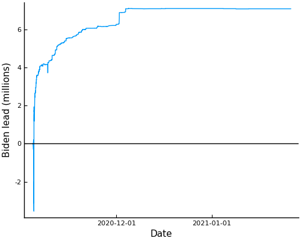

#election2020

A CSV file containing time-stamped voting updates in the 2020 US presidential election. Data originate from [Edison research](https://www.edisonresearch.com/election-polling/), but are compiled by the New York Times. 

Each row is a date/time specific cumulative count of votes for each presidential candidate by state (aggregating 3rd party candidates). Note that cumulative counts occasionally go down, which has been misinterpreted as evidence of fraud by those who wish to find evidence of fraud. There is no indication in the data why these occur, but it is not unusual to see phenomena like that in data that are collected on-the-fly, regardless of the query. 

Also included is the Julia file to extract the data and compile the CSV (please do not run indiscriminantly, as it runs a new query of the NYT website each time).

Note that votes for each candidate are derived from an overall vote count and a fractional share, which leads to fractional votes, which have been rounded to 3 decimal places.
